======================
Integración con Pyplan
======================

Introducción
============

En esta sección se detalla cómo es posible consumir datos generados en una aplicación de Pyplan desde fuera de Pyplan.

API endpoint
============

---------------------------
Creación de un API endpoint
---------------------------

Para crear un API endpoint, es necesario crear un nodo cuyo resultado sea una función de Python que, opcionalmente, puede recibir parámetros.
Por ejemplo, el código del nodo podría ser el siguiente:

.. figure:: images/function.png

Luego, hacer click derecho sobre el nodo creado y elegir la opción **"Get API Endpoint"**:

.. figure:: images/get_api_endpoint_menu_option.png

Se desplegará la siguiente ventana:

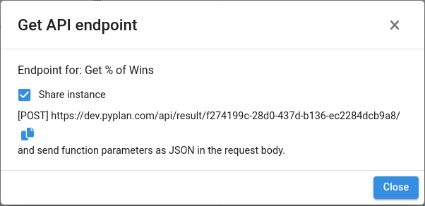

La opción **"Share instance"** permite que múltiples llamadas al API endpoint se atiendan desde una misma instancia sin necesidad de crear una nueva por cada llamada.
Por el contrario, deshabilitando esta opción, cada llamada creará una nueva instancia en Pyplan para atenderla.

Siguiendo con el ejemplo, la URL **"https://dev.pyplan.com/api/result/f274199c-28d0-437d-b136-ec2284dcb9a8/"** será nuestro API endpoint al cual podremos llamar desde fuera de Pyplan.

----------------------------------------
Estructura de la llamada al API endpoint
----------------------------------------
- Método HTTP: POST
- Content-Type: application/json
- Headers (opcional): si el endpoint tiene asignado una Api key, se debe enviar como parámetro "x-api-key".
- Body (Opcional): form-data. Aquí se envían los parámetros para alimentar la función.

Ejemplo realizado en plataforma Postman:

.. figure:: images/postman.png

-----------------------
Gestor de API endpoints
-----------------------
En la sección **"External Link Endpoints"** es posible editar y eliminar los API endpoints creados de la aplicación actual.

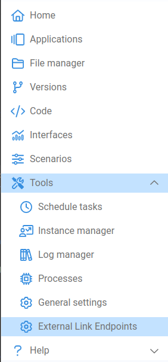

.. figure:: images/external_links_manager.png

Para editar un API endpoint, se debe seleccionar el enlace a editar y luego hacer click en el botón "Edit":

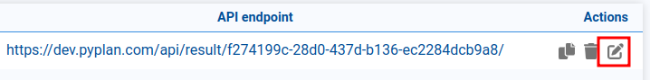

Se desplegará la siguiente ventana:

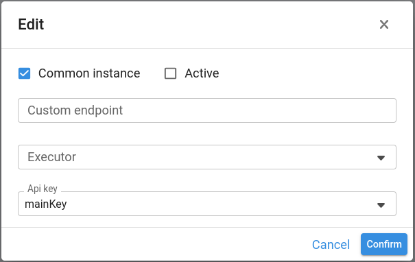

Opciones:

- Common instance: permite habilitar/deshabilitar el compartir la instancia al hacer múltiples llamadas.
- Active: permite habilitar/deshabilitar el API endpoint por completo.
- Custom endpoint: permite asignarle un nombre personalizado al link externo. El link final quedará disponible para copiar en el Gestor de API endpoints.
- Executor: permite elegir con qué usuario abrir la instancia.
- Api key: permite seleccionar una clave creada anteriormente que deberá enviarse como Header en la llamada al endpoint con la clave "x-api-key".

Para confirmar los cambios, se debe hacer click en el botón **"Confirm"**. Para no aplicar los cambios, hacer click en **"Cancel"**

Para borrar un API endpoint, se debe hacer click en el siguiente ícono:

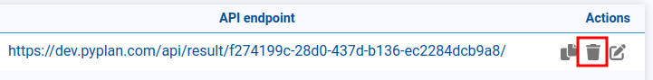

------------------
Gestor de API keys
------------------
Para crear, editar o eliminar Api keys, se debe acceder a través del botón "Show Api keys":

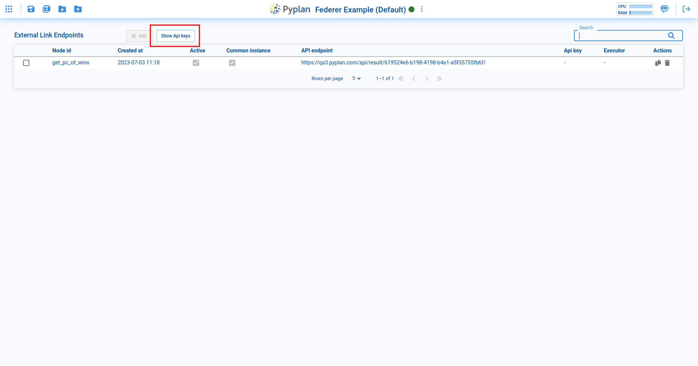

Para crear una nueva Api key, hacer click en el botón "Create Api key":

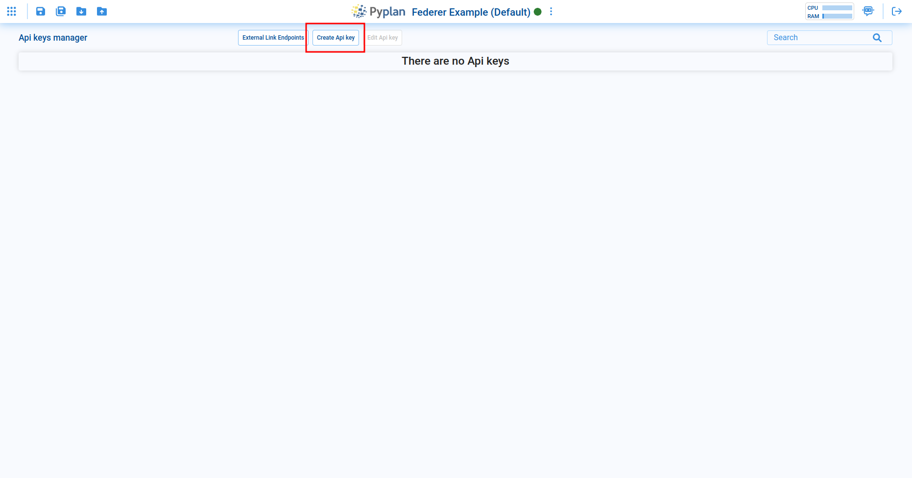

Se desplegará la siguiente ventana:

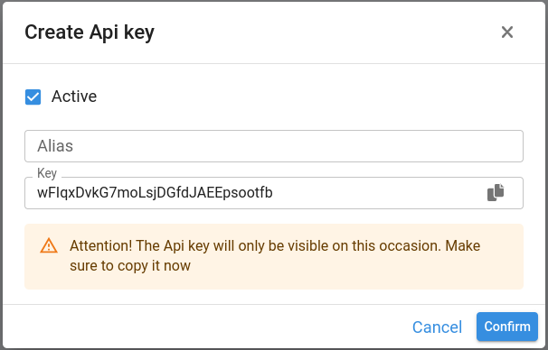

Opciones:

- Active: permite habilitar/deshabilitar la Api key.
- Alias: permite asignarle un nombre personalizado a la Api key para que sea más fácil de reconocer al asignarla a  Api endpoints.
- Key: la clave misma. Es posible editarla por una personalizada. Guardar esta clave de manera segura ya que no será posible visualizarla luego de creada. Sólo podrá generarse una nueva o eliminarse.

Para confirmar los cambios, se debe hacer click en el botón **"Confirm"**. Para descartar la creación, hacer click en **"Cancel"**

Para editar una Api key, se debe seleccionar la Api key a editar y luego hacer click en el botón "Edit Api key":

.. figure:: images/external_links_api_key_edit.png

Se desplegará una ventana con las mismas opciones que al crear una nueva Api key.

Para borrar una Api key, se debe hacer click en el siguiente ícono:

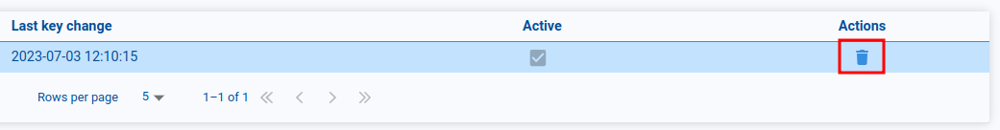

Para asignar una Api key a un Api endpoint, se debe editar el Api endpoint y seleccionar la Api key que se desee:

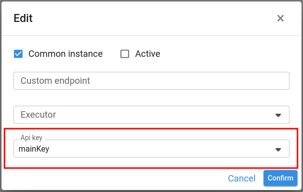

Link a interfaz
===============

------------------------------
Creación de un Link a interfaz
------------------------------

Para crear un Link a interfaz, se debe ir a la sección Interfaces:

.. figure:: images/interface_links_interfaces_option.png

Luego, elegir la interfaz que se desea compartir, hacer click en las opciones de la interfaz y elegir la opción **"Interface link"**:

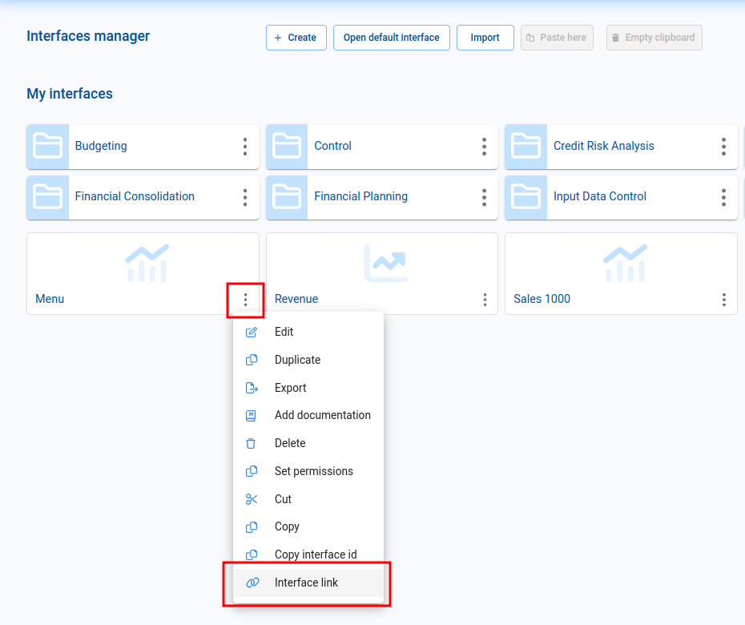

Se desplegará la siguiente ventana:

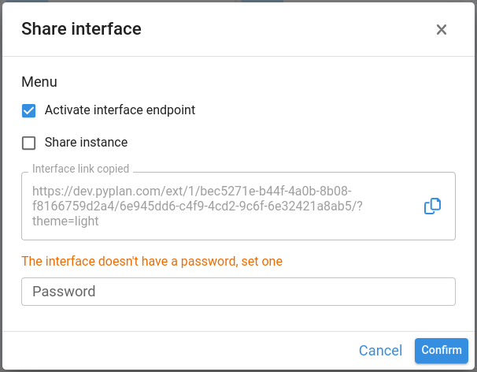

La opción **"Share instance"** permite que múltiples usuarios que utilicen este link sean atendidos desde una misma instancia sin necesidad de crear una nueva por cada usuario.
Por el contrario, deshabilitando esta opción, cada usuario creará una nueva instancia en Pyplan para atenderlo.

Desde esta ventana es posible agregar una contraseña que se solicitará al cargar el link. Para hacerlo, completar el campo **"Password"**. Guardar esta contraseña de manera segura ya que no será posible visualizarla luego de creada. Sólo podrá reemplazarse por una nueva o eliminarse.

Siguiendo con el ejemplo, la URL **"https://dev.pyplan.com/ext/1/bec5271e-b44f-4a0b-8b08-f8166759d2a4/6e945dd6-c4f9-4cd2-9c6f-6e32421a8ab5/?theme=light"** será nuestro link que podremos compartir con personas que no sean usuarias de Pyplan.
Es posible personalizar el tema que queremos que se inicie por defecto a través del parámetro **"theme"** al final de la URL. Los valores aceptados son: **"light"** (claro) o **"dark"** (oscuro).

----------------------
Uso de Link a interfaz
----------------------
Para utilizar el Link a interfaz, simplemente copiarlo y pegarlo en la barra de direcciones del explorador.

En caso de haberse establecido una contraseña, ésta será solicitada al ingresar:

.. figure:: images/interface_links_ask_password.png

Luego de unos instantes, se visualizará la interfaz compartida:

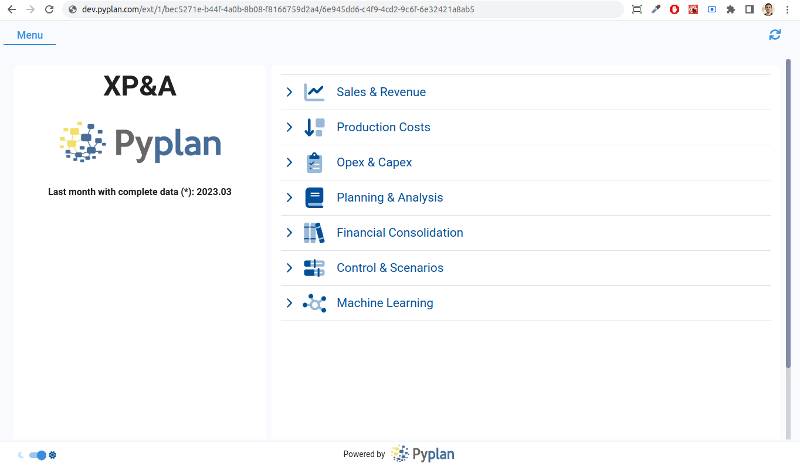

Los usuarios que ingresan a través de un Link a interfaz sólo tienen permisos para visualizar esa interfaz y todas aquellas a las que pueda navegar a través del menú de la aplicación, si éste estuviera presente en la interfaz compartida original.

----------------------------
Gestor de Links a interfaces
----------------------------
En la sección **"Interface links"** es posible editar y eliminar los Links a interfaces creados de la aplicación actual.

.. figure:: images/interface_links_interface_links_option.png

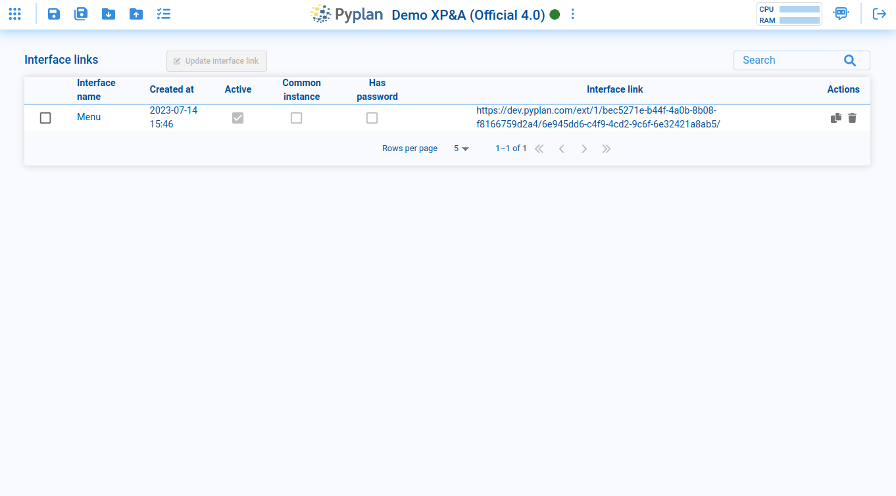

Para editar un Link a interfaz, se debe seleccionar el link a editar y luego hacer click en el botón "Update interface link":

.. figure:: images/interface_links_edit.png

Se desplegará la siguiente ventana:

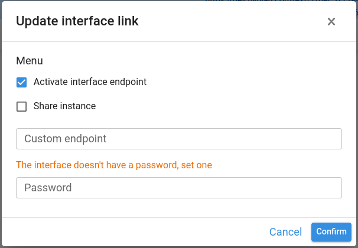

Opciones:

- Activate interface endpoint: permite habilitar/deshabilitar el link por completo.
- Share instance: permite habilitar/deshabilitar el compartir la instancia al ingresar múltiples usuarios con el mismo link.
- Custom endpoint: permite asignarle un nombre personalizado al link compartido. El link final quedará disponible para copiar en el Gestor de Links a interfaces.
- Password: permite ingresar una contraseña que se solicitará al cargar el link. Guardar esta contraseña de manera segura ya que no será posible visualizarla luego de creada. Sólo podrá reemplazarse por una nueva o eliminarse.