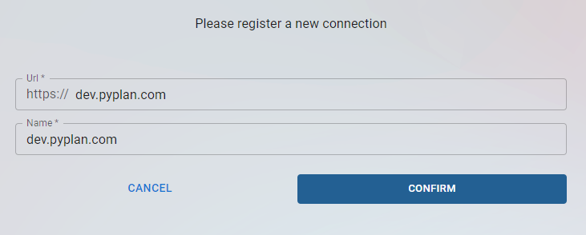
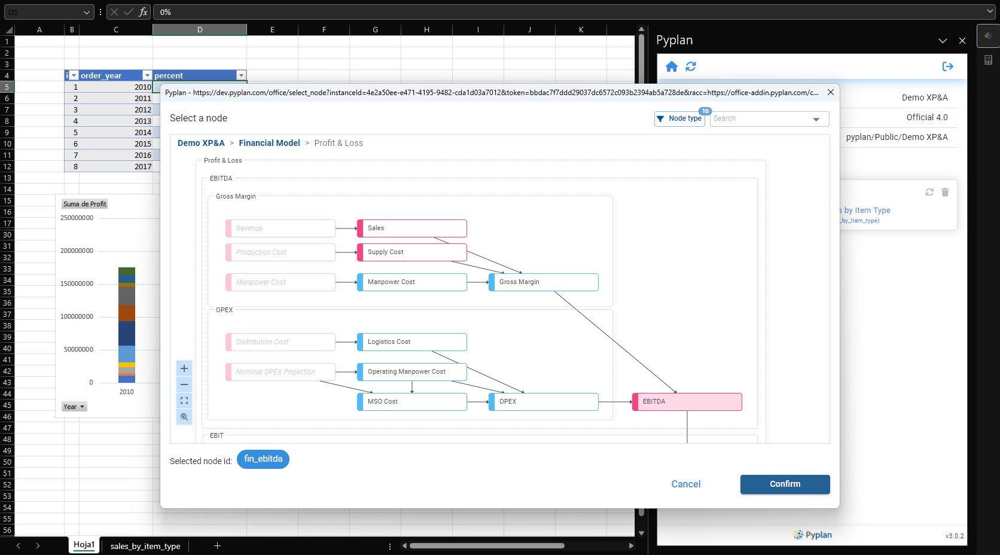
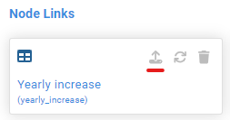

=====================
Complemento de Office
=====================

Introducción
============

En esta sección se detalla cómo puedes utilizar el complemento de office para comunicarte con tu aplicación en Pyplan.

Instalación
===========

Para agregar el complemento de Pyplan, despliega la lista de complementos y utiliza el buscador. Luego seleccionas **Pyplan for Microsoft 365** y confirmas la instalación.

Inicio de sesión
================

Para iniciar sesión en una instancia de Pyplan, primero deberás registrar dicha instancia. Para realizar esto sigue los siguientes pasos:

- Click en el botón *Sign in*

.. figure:: images/signin.png

- Si es la primera vez que ingresas, deberás registrar la instancia a la cual deseas conectarte. Para esto haz click en el botón **+** y luego completa los datos de la instancia y luego click en confirmar.

.. admonition:: Conexión utilizando SSO
    
    Si vas a utilizar el inicio de sesión con SSO (Single Sign On), en la url deberás agregar /saml/[nombre de la empresa]. Ejemplo: https://dev.pyplan.com/saml/pyplan

- Una vez que registres la conexión, quedará disponible para próximos inicios de sesión. Luego has click en la conexión que desees utilizar e inicia sesión utilizando tus credenciales.

Abrir una aplicación
====================

- Luego de haber iniciado sesión podrás abrir alguna de las aplicaciones que tengas disponibles, tanto de tu espacio privado como del espacio público o de algún equipo de trabajo al cual pertenezcas.

.. figure:: images/open_app.png

Node Links
==========

Los **Node Links** son vínculos entre hojas de cálculo o rangos de Microsoft Excel y nodos de Pyplan. Estos vínculos te permiten enviar y recibir información hacia y desde tu aplicación de Pyplan.

Tipos de Node Links
-------------------

Existen dos tipos de **Node Links**:

- salida de datos: permiten obtener datos desde Pyplan
- entrada de datos: permiten enviar datos hacia Pyplan

Para crear un **Node Link** de salida de datos realiza los siguientes pasos:

- Click en el botón **+**.
- Selecciona el destino de los datos. Puede ser en la celda seleccionada o en una nueva hoja. En caso de que selecciones una nueva hoja, se creará una hoja con el ID del nodo de Pyplan.
- Seleccionar el nodo de Pyplan desde el cual se obtendrán los datos. Todos los nodos son de salida de datos, excepto los nodos de tipo formulario.

Para crear un **Node Link** de entrada de datos realiza los mismos pasos anteriormente mencionados, pero selecciona un nodo de tipo formulario. Esto te permitirá
modificar los valores de las celdas y luego enviar los datos a Pyplan.
Para enviar los datos a Pyplan una vez modificadas las celdas de la tabla debes hacer click en el botono de **enviar datos**.

.. admonition:: Envío de datos
    
    Al enviar datos a Pyplan, se actualizará el nodo de tipo Formulario y si en el libro de Excel existen nodos que dependen del nodo actualizado, los mismos se actualizarán con el nuevo resultado.
    También puedes hacer una tabla dinámica tomando como base la tabla de salida de datos. Al actualizar el Node link también se actualizarán las tablas dinámicas.

