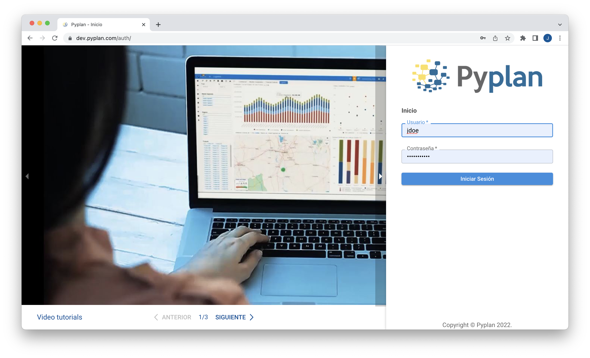
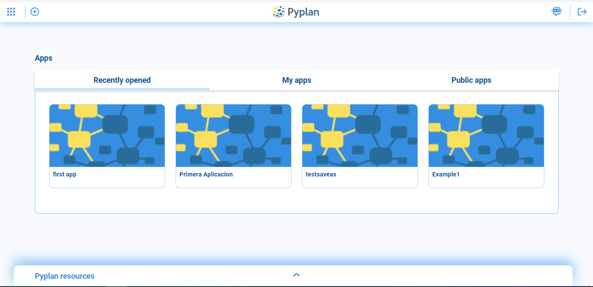

Acceso a Pyplan
===================
Al acceder a la dirección de internet del servidor donde se encuentra instalado Pyplan, la siguiente pagina de inicio se presenta para introducir las credenciales de acceso.
Pyplan posee la funcionalidad de **"Single Sign On"** por lo que usuarios que pertenezcan a un servidor de dominio seran automaticamente reconocidos (Validar).

Una vez dentro de la plataforma se despliega la siguiente pantalla donde encontramos:

.. list
* menu de acceso a diversas funcionalidades
* (+) Creación de nueva aplicación
* tabs de acceso a las aplicaciones recientemente abiertas, aplicaciones propias y aplicaciones publicas
* acceso al Chatbot de ayuda
* acceso a recursos para el aprendizaje de Pyplan
* cerrar la sesión en el servidor

