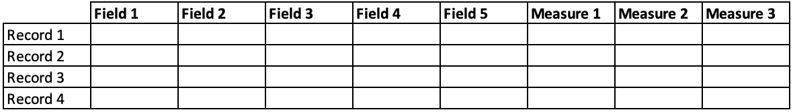

Codificando en Pyplan
=====================
==================
No Code / Low code
==================
Pyplan es una plataforma pensada para usuarios sin conocimientos de programación por lo que permite hacer muchas tareas de manipulación y procesamiento de datos sin necesidad de codificación.

Pyplan interpreta de forma nativa dos estructuras de datos que son Tablas y Cubos de datos.
Los Cubos de datos pueden tener cualquier numero de dimensiones. Estas dimensiones a su vez pueden estar nominadas o ser indefinidas.

.. warning:: incluir un grafico que ilustre una tabla, un cubo xarray y un cubo numpy

 * Tablas `Dataframe <https://pandas.pydata.org/docs/user_guide/dsintro.html#intro-to-data-structures>`_ de Pandas
 * Cubos de datos (n-dimensiones)
    - Dimensiones nominadas `DataArray <https://docs.xarray.dev/en/stable/user-guide/data-structures.html>`_ de Xarray
    - Dimensiones indefinidas `Array <https://numpy.org/doc/stable/reference/arrays.html>`_ de Numpy

Tablas
------
En pocas palabras un Dataframe es una estructura del tipo tabla donde cada columna corresponde a un atributo o medida. Cada fila corresponde a un registro particular de esos atributos o medidas.

Una tabla se asemeja a una tabla en base de datos, su principal diferencia es que la misma reside en memoria no en disco, proviniendo de ahi su velocidad de procesamiento.

Las tablas en Pyplan son soportadas por la librería de Python denominada Pandas, una de las librerías mas utilizadas en Data Science.

Cuando un nodo es evaluado y su resultado es un Dataframe de Pandas, Pyplan presenta automáticamente un conjunto de herramientas para operar con ese Dataframe.

.. image:: images/tabla_wizard.png

Al utilizar esos asistentes para la operación deseada, el usuario podrá observar como el código de definición se va generando.

Cubos
-----
