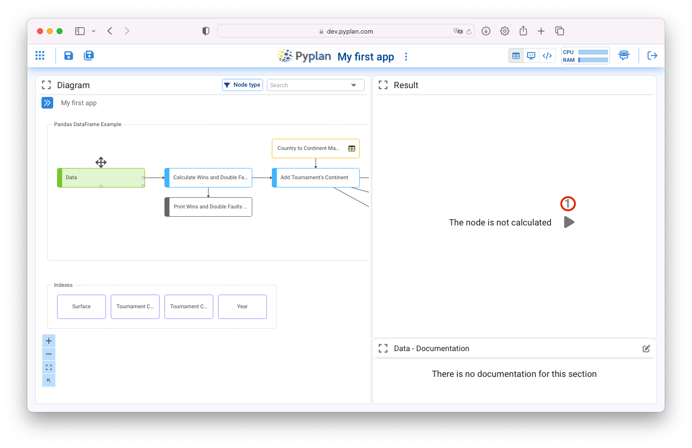
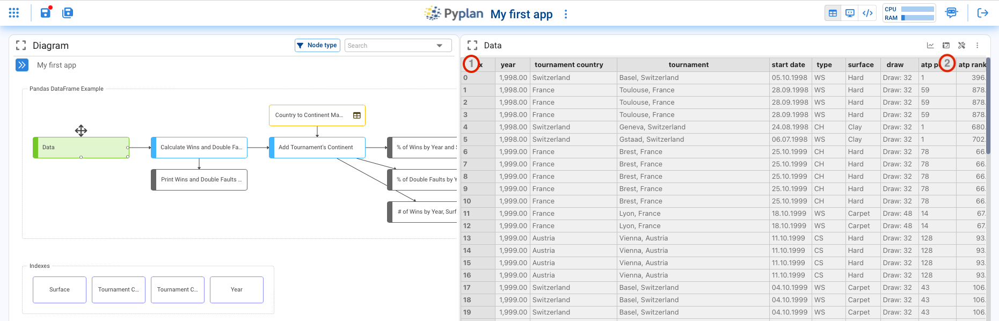
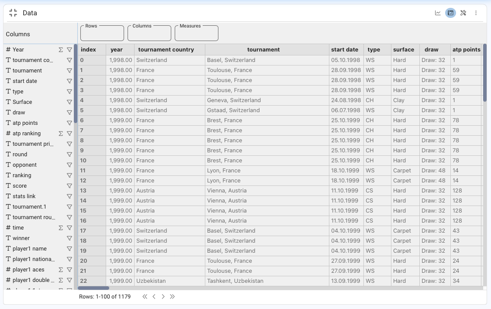
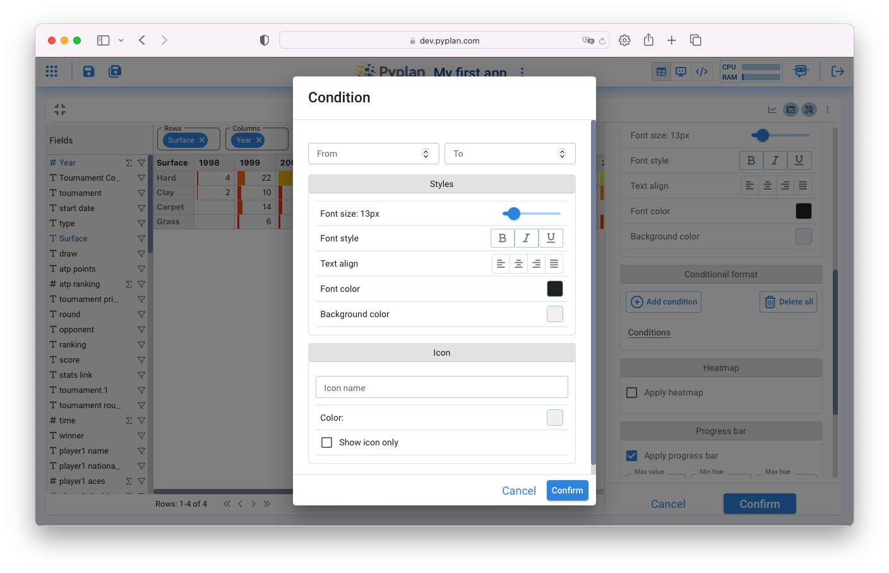
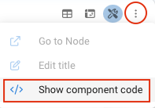
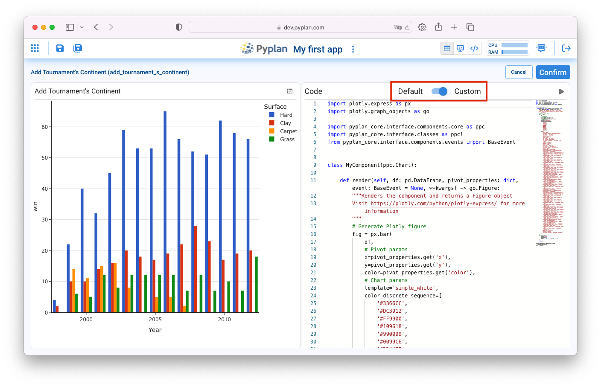

========================
Análisis y Visualización
========================

Pyplan es una plataforma **No-code / Low-code** pensada para usuarios sin conocimientos de programación 
por lo que permite hacer muchas tareas de manipulación y procesamiento de datos sin necesidad de codificar.

Uno de los objetivos de Pyplan es proveer transparencia a la lógica de cálculo, permitiendo para ello, 
no solo navegar por el proceso de calculo para entender conceptualmente su flujo, 
sino también seleccionar ejecutar y visualizar los resultados de cada paso.
Esta visualización puede ser en forma de tabla o gráfico.

Al navegar el diagrama de influencia se puede seleccionar cualquier nodo, ejecutarlo y visualizar su resultado. 

Visualización en formato de Tabla
=================================
Haciendo click sobre el nodo verde con titulo "Data" veremos lo siguiente:

Para ejecutar el nodo se debe hacer click en el icono de evaluación indicado en (1) en el gráfico. 
Luego que el mismo se ejecute aparecerá una tabla como la que se muestra en la siguiente captura:

Maximizando la ventana de visualización (1) y luego haciendo click en (2) accedemos a los campos de esta tabla de datos:

Donde podemos ver cada campo y medida de la Tabla, el tipo de campo (Numerico # o Texto T), y la función de agrupamiento que se ejecutará en caso de ser necesario (Suma, Max, Min, Promedio o Conteo)

Arrastrando el campo "Years" a la casilla de columnas y luego de definir el Promedio como función de agregación del campo "atp ranking" lo arrastramos a la casilla de "Medidas" obtendremos una tabla como muestra la siguiente imagen:

.. image:: images/year_rank.png
 
 

Esta tabla describe la evolución en el tiempo del ranking promedio anual de "Roger Federer"
Cualquier campo puede ser desplegado como Columna o Fila provocando la agrupación de las medidas visualizadas correspondientes.

Formato de Tabla
----------------

Haciendo click en (3) se despliegan las alternativas de formatación de la tabla de datos. Las mismas se agrupan en: General, Data, Styles, Index sync.

.. image:: images/table_config.png

El lector puede investigar las opciones de configuración agrupadas en General y Data por su propia cuenta.

La sección Styles agrupa las configuraciones de estilo de la tabla con un comportamiento particular que le otorga flexibilidad y consiste en lo siguiente:

Una primera sección encabezada por "Apply to" indica el objetivo o destino de la configuración establecida mas abajo. 
Por defecto este objetivo es "All" que significa que lo que se configure a continuación aplicará a toda la tabla.
En este caso particular podríamos establecer con el formato de numero entero a toda la tabla.

.. image:: images/table_style.png
      :align: center

De igual manera podríamos establecer un formato particular para una condición específica de alguna dimensión. 
En este caso por ejemplo definir con fondo verde los resultados que corresponden a la superficie "Grass"

.. image:: images/style_conditions.png

Definiendo el estilo correspondiente lograremos el resultado mostrado en la siguiente imagen:

.. image:: images/grass_style.png

Formato condicional
-------------------
Es posible establecer formatos basados en condiciones particulares de los valores de la tabla.
Para ello se deben agregar las condiciones y el formato de acuerdo a lo que indica la siguiente imagen:

Dos casos particulares del formato condicional que vienen  predefinidos dentro de Pyplan son el Heatmap y el Progress Bar.

Heatmap
-------
La opción de formatear la tabla con un heatmap aparece deplazandose hacia abajo entre las opciones de estilo.

.. image:: images/heatmap.png

Progress Bar
------------
La visualización de la tabla con un formato de Progress Bar puede ser configurada como lo indica la figura abajo:

.. image:: images/progress_bar.png

Visualización en formato de Gráfico
===================================

Haciendo click en el icono indicado en la figura (1) se intercambia la vista de tabla a gráfico. Toda vez que el tipo de grafico seleccionado lo permite, Pyplan asigna automaticamente campos de la tabla al gráfico.

.. image:: images/view_chart.png

Configuración de la Visualización
---------------------------------

Existen multiples tipos de gráficos que pueden ser configurados como alternativas de visualización de los datos como lo muestra la siguiente figura.
Cada tipo de gráfico tiene sus sub-tipos y en función de esta elección se definen las propiedades que deben ser indicadas para permitir la construcción del gráfico.

.. image:: images/tipos_grafico.png

Una vez elegido el tipo de gráfico, sus propiedades son agrupadas en las siguiente secciones:

.. image:: images/chart_properties.png
    :align: center

Codificando Visualizaciones
---------------------------

Pyplan permite a traves de la interfaz de usuario la configuración de los parámetros de uso mas frecuentes de cada tipo de gráfico.
No obstante ello, existen muchas otras propiedades de los gráficos que pueden definirse desde el código de cada elemento de visualización.

.. raw:: html
    <embed>

  Para acceder a personalizar el código de visualización se debe hacer click sobre el icono &nbsp; <i class="fa fa-ellipsis-v" aria-hidden="true"></i>&nbsp;&nbsp;

  y luego elegir <i class="fa fa-solid fa-code"></i> <b> Show component code</b>  
  &nbsp;&nbsp;&nbsp;&nbsp;
    </embed>

    
Una vez hecho esto, y luego de mover el switch de Code desde Default a Custom, podremos comenzar a modificar el código de comportamiento de la visualización gráfica.

Una guia completa de las propiedades configurables de cada gráfico puede encontrarse aquí:
`Plotly Express in Python <https://plotly.com/python/plotly-express/>`_ 
