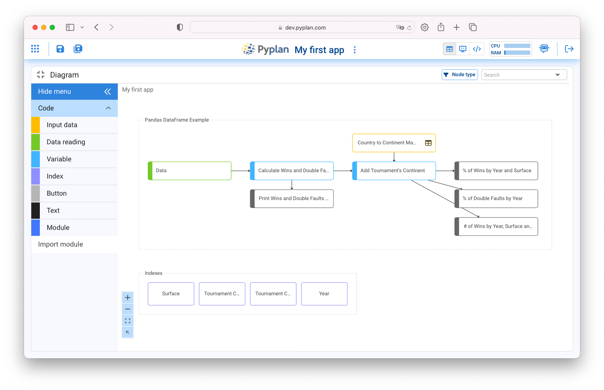
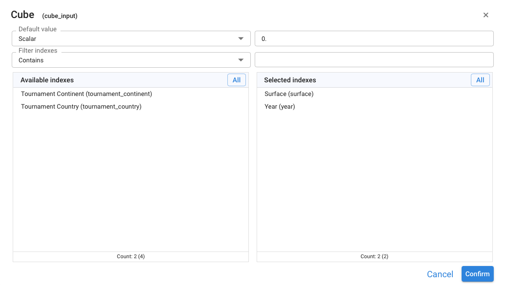
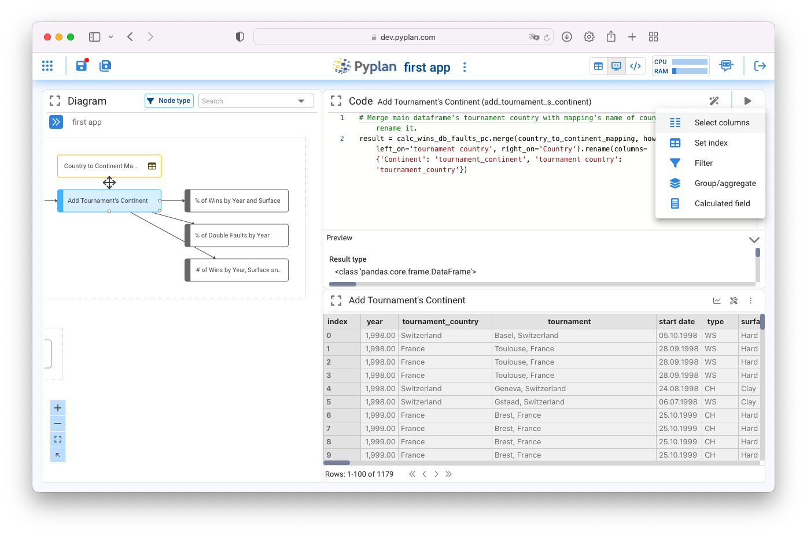

=====================
Codificando en Pyplan
=====================

Uno de los aspectos distintivos de Pyplan es la forma en que el código es organizado a través de un diagrama de influencia jerárquico,
donde cada nodo representa alguna etapa en la carga o procesamiento de la información.

Los nodos son los repositorios de porciones de código que puede ser introducido de forma directa por el usuario 
o generado automáticamente por un asistente de Pyplan al parametrizar o manipular interfaces desarrolladas para este fin.

El diagrama se construye arrastrando los diferentes tipos de nodo sobre la hoja del diagrama.
La ventana de nodos se despliega haciendo click sobre este |desplegar| icono que aparece en el extremo superior izquierdo del diagrama.

.. |desplegar| image:: images/desplegar_nodos.png
               :scale: 80%

Las flechas que indican la relación entre nodos son generadas automaticamente al referenciar una variable como fuente de datos de entrada de un proceso subsiguiente.

Los nodos tienen diferentes colores que ayudan a entender la función que cumplen dentro del diagrama.

No-code
=======

Pyplan es una plataforma pensada para que usuarios sin conocimientos de programación puedan construir y compartir aplicaciones de Data Analytics y Planning.

La construcción de una aplicación requiere como primer paso la entrada de datos, la cual puede ser manual o por lectura de una fuente de datos externa.

-------------------------
Entrada de Datos Manuales
-------------------------

La entrada de datos manuales se construye arrastrando un nodo de color amarillo "Input Data". 
Este tipo de nodo, una vez definido un título, abre un asistente que permite definir que tipo de dato manual se pretende ingresar.

.. figure:: images/manual_input.png

   *Asistente de entrada de datos manuales*

Entrada de un Escalar
---------------------

Es la entrada utilizada para ingresar un parámetro único. Una vez definido el título del nodo se representa asi en el diagrama: |scalar|

.. |scalar| image:: images/scalar.png
            
            

Entrada de un Selector
----------------------

Se utiliza para ingresar las diferentes alternativas de elección que se presentarán en un selector desplegable. Una vez creado aparece asi dentro del diagrama: |selector|

.. |selector| image:: images/selector_list.png
              :align: top

Entrada de una Tabla
--------------------

Se utiliza para ingresar multiples parámetros que son organizados en una estructura de tabla, 
donde cada columna representa un atributo y en cada fila se ingresa un registro.
Luego de ingresar un título al nodo, se abre un asistente que permite definir los campos que constituirán la tabla de datos 
y el tipo de datos que sera ingresado.

.. image:: images/table_wiz.png

Una vez creado aparecerá asi en el diagrama: |tabla|

.. |tabla| image:: images/table.png

Seleccionando el nodo tabla, y luego haciendo doble-click sobre el mismo se abre la tabla a pantalla completa para ingresar datos.

.. admonition:: Almacenamiento de Tablas

   Los datos aquí cargados son almacenados en un objeto denominado **Pandas Dataframe** 
   Pyplan interpreta este tipo de objetos de forma nativa, permitiendo su manipulación y visualización en forma de tabla y gráfico.

Entrada de un Formulario
------------------------
El formulario es la herramienta mas potente y versátil de entrada de datos manuales ya que permite combinar columnas de entrada de datos
junto con columnas calculadas que sirven de referencia o guía para el dato que esta siendo ingresado.
Por ejemplo si estamos creando una herramienta para ingresar datos de un presupuesto de ventas, 
puede ser de ayuda para quien ira a ingresar esos datos tener como referencia la ventas del año anterior.
El formulario, a diferencia de la Tabla, es almacenado un una base de datos, permitiendo por lo tanto que multiples usuarios ingresen datos de forma simultanea.

Al arrastrar un nodo de entrada de datos, y luego de haber elegido Formulario como elemento de entrada se muestra el siguiente asistente para su creación:

.. image:: images/form_wiz_type.png

Definiendo un titulo para cada campo de entrada, se genera una sugerencia de nombre de campo, luego el tipo de columna de acuerdo con las opciones que muestra el cuadro desplegable.

Adicionalmente el formulario permite definir los siguientes parametros:

.. image:: images/form_settings.png
   :align: center

Entrada de un Cubo
------------------
Un cubo de datos es un objeto entrada particular que permite el ingreso de un solo parámetro para todas las combinaciones de las dimensiones del cubo.
Es por esto que para su definición es necesario indicar cuales son las dimensiones del cubo de datos de entrada.
Su uso es indicado cuando se quiere enfatizar la entrada de datos en todos los elementos de las dimensiones de apertura.

--------------------------
Lectura de fuente de Datos
--------------------------

conexión a fuentes de datos externas (comentar las opciones con wizards)

------------------------------------
Manipulación y Operaciones con Datos
------------------------------------

- variable (conectar a la lectura, ejecutar, explicar wizards, mostrar la alteracion de codigo)
- Index se vera mas adelante

-------------------------
Organizacion del diagrama
-------------------------
Text
Modulo (arrastrar, cortar y pegar)
Color de los nodos funcionamiento

------------------
Ejecucion de nodos
------------------
Funcionamiento del mecanismo de calculo

Low-code
========

Pyplan interpreta de forma nativa algunas estructuras de datos del tipo Tablas y Cubos proveniente de las librerías de Python mas difundidas (Pandas, Numpy, Xarray).
Los Cubos de datos pueden tener cualquier numero de dimensiones. Estas dimensiones a su vez pueden estar nominadas o ser indefinidas.

.. note:: incluir un grafico que ilustre una tabla, un cubo xarray y un cubo numpy

 * Tablas `Dataframe <https://pandas.pydata.org/docs/user_guide/dsintro.html#intro-to-data-structures>`_ de Pandas
 * Cubos de datos (n-dimensiones)
    - Dimensiones nominadas `DataArray <https://docs.xarray.dev/en/stable/user-guide/data-structures.html>`_ de Xarray
    - Dimensiones indefinidas `Array <https://numpy.org/doc/stable/reference/arrays.html>`_ de Numpy

Tablas
------
Una tabla se asemeja a una tabla en base de datos, es decir es una estructura de datos donde cada columna representa un atributo o medida y donde cada fila corresponde a un registro particular de esos atributos o medidas.

.. raw:: html
    <embed>
        Lorem ipsum dolor sit amet,         
        
        Lorem ipsum dolor sit amet, 
    </embed>
    
texto anterior

.. image:: images/open_node_drag.png
    :alt: alternate text to be displayed
    :class: with-shadow float-right

.. 
texto posterior cubriendo la parte no ocupada por la imagen se renderiza de esta forma

.. image:: images/table_nd_cube.png
 
Las tablas de datos en Pyplan corresponden al objeto **Dataframe** de la librería Pandas, una de las librerías mas utilizadas en Data Science. Documentación sobre las funcionalidades de de los `Dataframes en Pandas puede consultarse aquí. <https://pandas.pydata.org/docs/user_guide/dsintro.html#intro-to-data-structures>`_ 

La principal diferencia entre una tabla en base de datos y un Dataframe es que este último reside en memoria y no en disco. De ahi proviene su velocidad de procesamiento.

Cuando un nodo es calculado y su resultado devuelve un objeto Dataframe de Pandas, Pyplan presenta automáticamente un conjunto de herramientas para operar con ese Dataframe.

Al utilizar esos asistentes para la operación deseada, el usuario podrá observar como el código de definición se va generando.

Cubos
-----
- Desarrollar el concepto de cubo
- Mostrar herramientas de creacion de cubos e indices a partir del dataframe
- input dataarray mencionar
- operaciones con cubos (broadcasting de dimensiones)
- funcionamiento del dynamic

Ayudas a la codificacion 
------------------------
- intellisense
- tooltips
- shortcuts de navegacion (Ctrl+click, alt/option + click, pineado de nodos)
- bot 
- asistente de codigo
- preview
- consola de errores

manejo de librerias
-------------------
importacion y uso de librerias

libreria