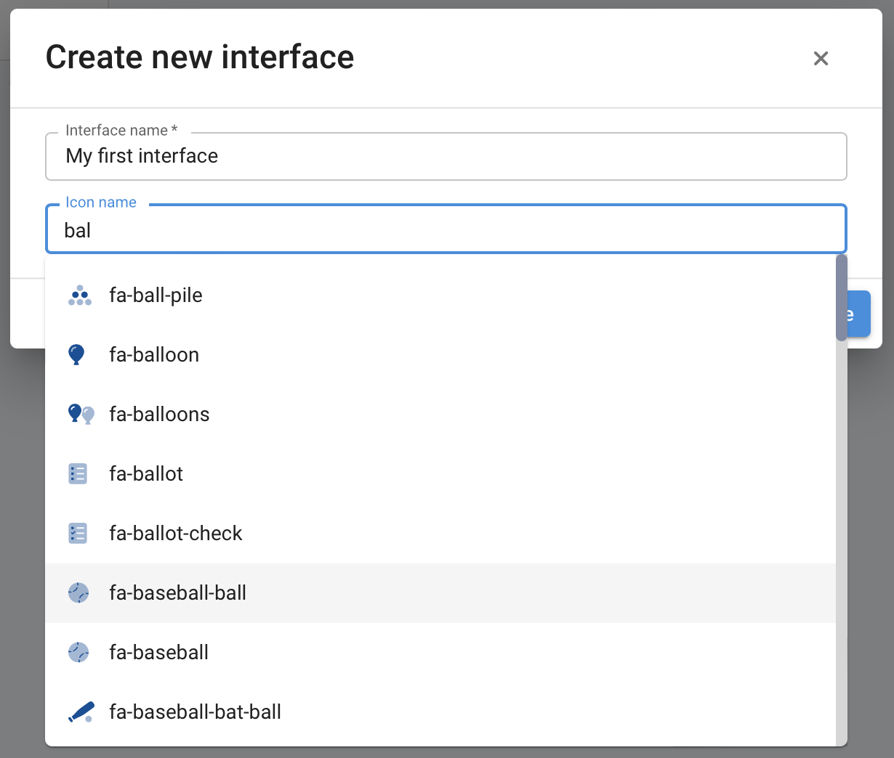
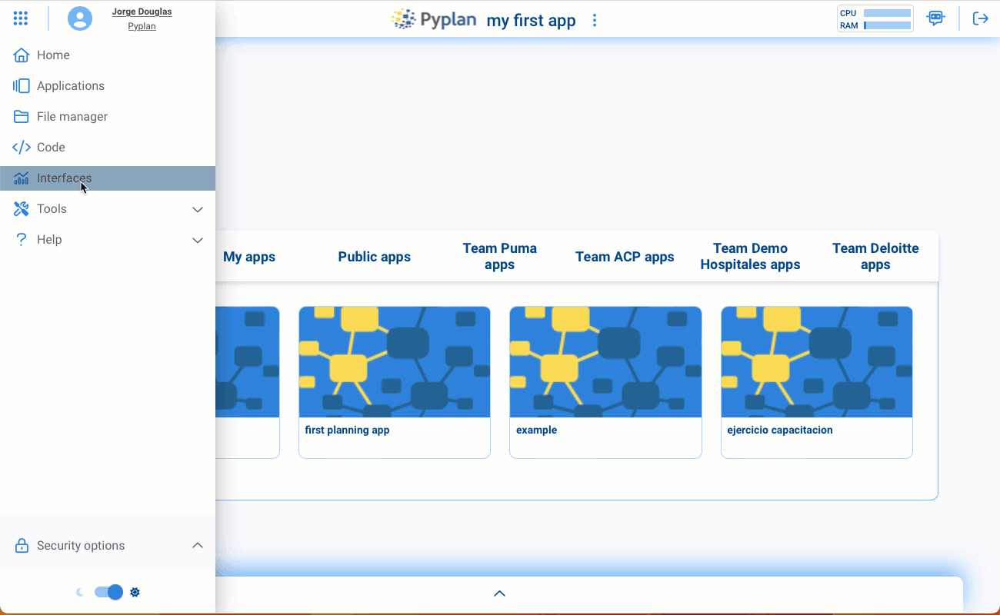
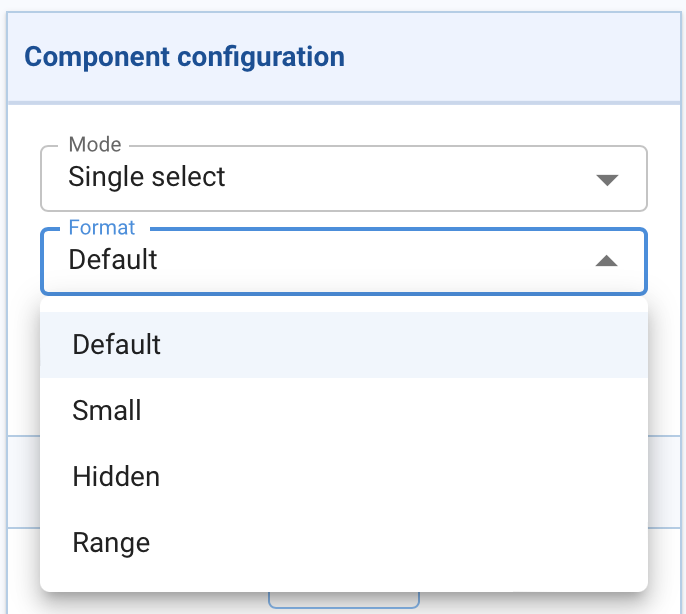

====================
Interfaces en Pyplan
====================

Introducción a las interfaces
=============================

En esta sección es donde se crean y administran las herramientas de entrada y salida de datos de las aplicaciones creadas con Pyplan.
Las interfaces están compuestas por componentes (widgets) que se arrastran desde una caja de herramientas a la pantalla de la futura interfaz.
Estos componentes dialogan de forma permanente con las reglas de calculo para permitir la interacción entre el usuario y la aplicación.
Es asi que al modificar un parámetro de entrada, esa alteración es computada en tiempo real y el resultado de salida presentado al usuario.

Para acceder al modulo de interfaces se debe hacer hacer click en la sección denominada **"Interfaces"** del menu principal.

.. figure:: images/menu_interfaces.png
    :scale: 50%

Continuando con el ejemplo en desarrollo sobre Data Analytics - Estadísticas de Roger Federer, al abrir la seccion "Interfaces"
nos encontramos con las siguientes opciones:

.. figure:: images/crear_interface.png

Haciendo click sobre Federer's Statistics se despliega la siguiente interfas:

.. figure:: images/federer_interface.png

Aquí se pueden ver en una primera linea diferentes componentes de entrada para seleccionar un periodo de tiempo ("Years"), 
una superficie de juego ("Surface"), o un continente ("Tournament Continent").
Interactuando con estos componentes se puede apreciar el impacto en los gráficos de salidas que están abajo.
En el extremos superior derecho se puede ver el icono para entrar en el modo de edición de una interfaz:

.. figure:: images/edit_interface.png
    :scale: 50%

Al hacer click en el icono de edición se pueden apreciar los diferentes componentes y el menu de creación:

.. figure:: images/interface_edit_mode.png

Creación de una interfaz
========================
Para comenzar a crear una interfaz haremos click sobre el botón **"Create"**

.. figure:: images/create_interface.png
    :scale: 50%

Luego se debe asignar un nombre a la interfaz y elegir un icono que la represente

Finalmente se puede comenzar el diseño de la interfaz haciendo click en el icono de edición

.. figure:: images/open_new_interface.png

En el siguiente video se aprecia como se crea una interfaz, se inicia su edición y se agrega un componente dentro de la misma.

Elementos a incluir en una interfaz
===================================

Existen diferentes componentes que pueden insertarse en una interfaz

.. figure:: images/components.png 

----
Node
----

Es el caso mas general. Cuando arrastramos un nodo, el mismo se presenta en la interfaz con la misma configuración de visualización que se determinó en el diagrama.
Esta vista puede posteriormente configurarse de forma diferente y los cambios no afectaran la vista del diagrama.

-----
Index
-----

Cuando arrastramos un índice, el mismo será automáticamente considerado como una interfaz de filtrado de todo otro elemento (gráfico o tabla) que posea esa dimensión en su estructura de datos.
Si este no fuera el comportamiento deseado se puede indicar la no sincronización de un elemento en relación a uno o varios indices.

.. figure:: images/index_config.png

El primer atributo a configurar es si el selector será de un único elemento o muchos:

.. figure:: images/index_single_multi.png
    :scale: 50%

Adicionalmente se puede elegir algunas opciones de representación de este selector en función de las necesidades de visualización:

-------------------------
Chart, Table or Indicator
-------------------------

Cuando se arrastra un componente de tipo gráfico, table o indicador, la vista por defecto del nodo no es considerada (aun cuando esta sea de tipo gráfico, tabla o indicador). 
Una vez localizado el componente se puede comenzar con la configuración del mismo de acuerdo al comportamiento deseado.

Ademas de las configuraciones de estilo es posible definir el vinculo entre las dimensiones de un nodo en particular y los indices explícitos en esa interfaz.

.. figure:: images/index_sync.png

Por ejemplo en este caso se ve como al haber de-seleccionado la sincronización del indice **"Surface"** al accionar sobre el mismo no se produce el filtrado en el gráfico.

Eventos en gráficos
-------------------

En la configuración de gráficos es posible utilizar activar algunos eventos para configurar el comportamiento de otros gráficos. 

Existen tres tipos de eventos:

.. figure:: images/events.png
    :scale: 50%

- **Drilldown:** al hacer doble-click sobre un gráfico permite navegar otras dimensiones que han sido agrupadas.
- **Selection event:** al activar este casillero, la selección efectuada en este gráfico es automáticamente aplicada a cualquier otro gráfico con dimensiones compartidas.
- **Hover event:** permite identificar lo que esta siendo señalado en un gráfico y lo utiliza para que actúe como filtro en otro gráfico.

----------
Input data
----------

Desde aquí se incluyen y configuran las interfaces de entrada de datos.

----
Html
----

Es un objeto que permite insertar hipertexto dentro de un cuadro. Su función principal es la de permitir información complementaria y personalización de la apariencia de las interfaces.

------
Button
------

Este objeto permite ejecutar código que opere con la aplicación para diferentes tipos de procesos, por ejemplo enviar mensajes de correo, correr modelos y salvar resultados, etc.

----
Menu
----

Este objeto permite crear menus de navegación de interfaces.