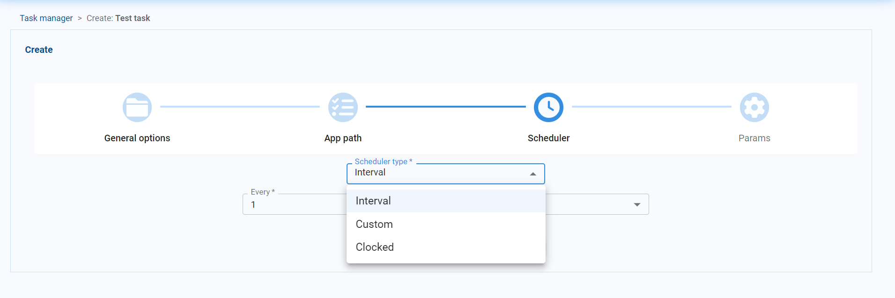
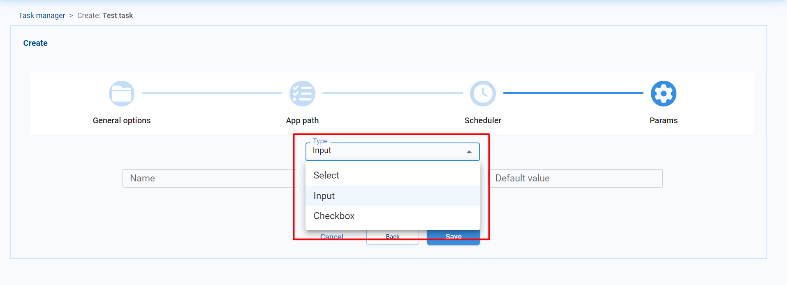
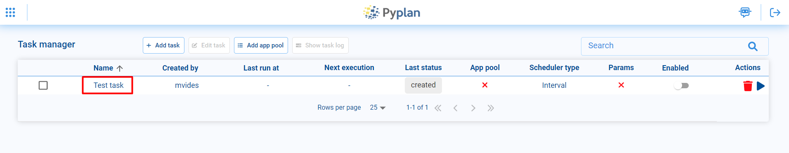
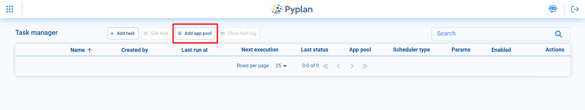
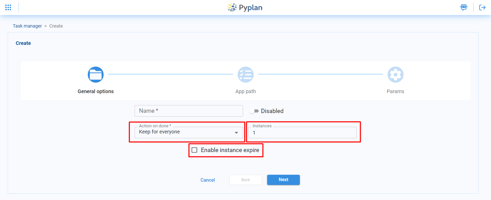
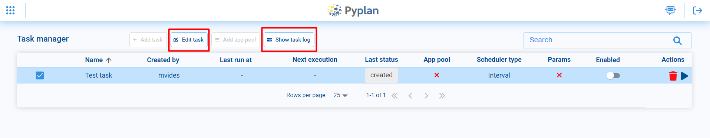
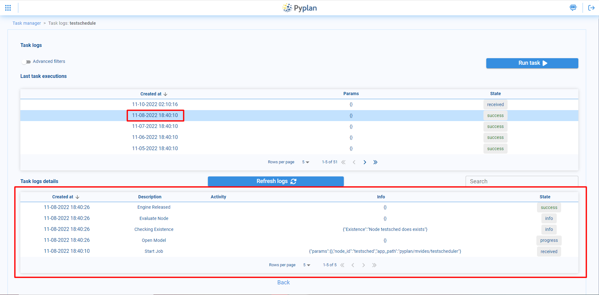

Tareas programadas
===================
Pyplan cuenta con un adiministrador de tareas para programar actividades de forma automática.
Esta herramienta se encuentra disponible en la barra lateral izquierda, debajo de menú **Tools**, en la opción de **Schedule tasks**.

.. image:: images/open_task_manager.png

Tareas
------ 
Para crear una tarea programada debemos seleccionar la opción **Add task** en la parte superior.

.. image:: images/create_task.png

|

A continuación se nos abrirá el menú de creación de tareas. En la parte de **General options** podemos 
elegir un nombre para nuestra tarea y tenemos la posibilidad de elegir si queremos que la tarea esté habilitada o no.

.. image:: images/name_task.png

|
    
Luego, en la opción de **App path** debemos seleccionar la aplicación y el nodo correspondiente que 
queremos que se ejecute con la tarea programada.

.. image:: images/app_path.png

|

Ahora en la opción de Scheduler podemos seleccionar en qué forma queremos que se ejecute nuestra tarea. Para ello disponemos de 3 opciones

1. **Interval**: Nos permite ejecutar nuestra tarea cada cierto intervalo de tiempo, por ejemplo, cada día o cada hora.
2. **Custom**: Nos da la mayor libertad para programar nuestra tarea, podemos seleccionar desde a que hora o días de la semana queremos que se ejecute
3. **Clocked**: Para correr la tarea en un día y hora específicos. 

|

Por último en el apartado **Params**, en caso de que el nodo que vamos a ejecutar en la tarea programada sea una función que dependa de 
ciertos parámetros, podemos especificar tales parámetros al momento de ejecutarla.

1. **Select**: Posibilita seleccionar los parámetros entre una lista predeterminada. 
2. **Input**: Permite que el usuario pueda ingresar el valor del parámetro.
3. **Checkbox**: El usuario podrá ingresar parámetros que puede tomar valores True o False mediante un checkbox.

|

Finalmente podremos ver la tarea creada en el **task manager**, donde también podremos monitorear la ejecución, 
habilitar/deshabilitar, editar o eliminar nuestra tarea, entre otras cosas.

App pool
--------

Una app pool es similar a una tarea programada, pero con la diferencia de que las instancias usadas 
para ejecutar un nodo de una aplicación pueden quedar ejecutandose y podemos acceder a ellas una vez que se haya terminado
de ejecutar el nodo correspondiente.
Para crear un pool de aplicaciones debemos seleccionar la opción **Add app pool** en la parte superior.

|

En la parte de **General options** podemos elegir un nombre para nuestra app pool y tenemos la posibilidad de 
elegir si queremos que la app pool esté disponible para todos los usuarios o solo para alguno en particular. 
También podemos elegir cuantas instancias estarán disponibles de la app. Y por último también podemos seleccionar, 
si lo deseamos, una fecha de expiración para las instancias.

|

Al igual que con las tareas programadas, en las opción de **App path** debemos seleccionar la aplicación y 
el nodo correspondiente que queremos que se ejecute.

.. image:: images/app_pool_path.png

|

En el apartado **Params**, en caso de que el nodo que vamos a ejecutar en la app pool sea una función que dependa de 
ciertos parámetros, podemos especificar tales parámetros al momento de ejecutarla.

1. **Select**: Posibilita seleccionar los parámetros entre una lista predeterminada. 
2. **Input**: Permite que el usuario pueda ingresar el valor del parámetro.
3. **Checkbox**: El usuario podrá ingresar parámetros que puede tomar valores True o False mediante un checkbox.

.. image:: images/app_params.png

Editar y ver logs 
-----------------

En caso de ser necesario, podemos editar alguna de las tareas o app pool, seleccionandola y haciendo click en la opción **Edit task**, 
donde podremos modificar todas las opciones que seleccionamos al crearla.

|

Además podremos monitorizar los logs de la tarea/app pool desde la opción **Show task logs**, donde nos aparecerán las últimas veces 
que fue ejecutada y podremos revisar los logs.

