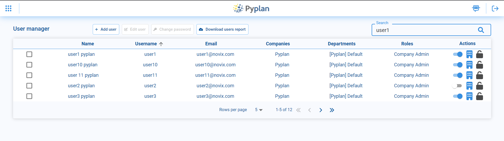
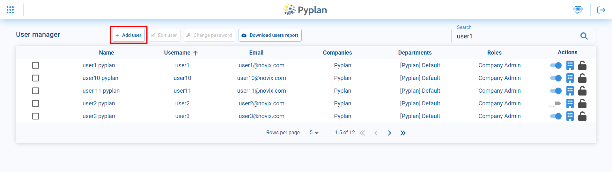
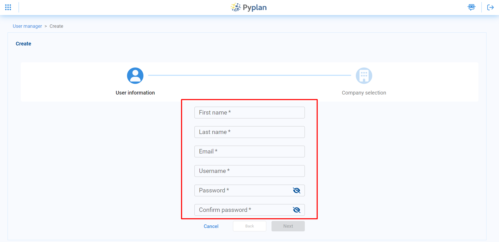
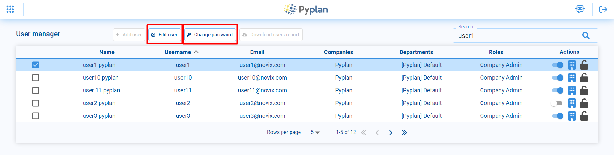
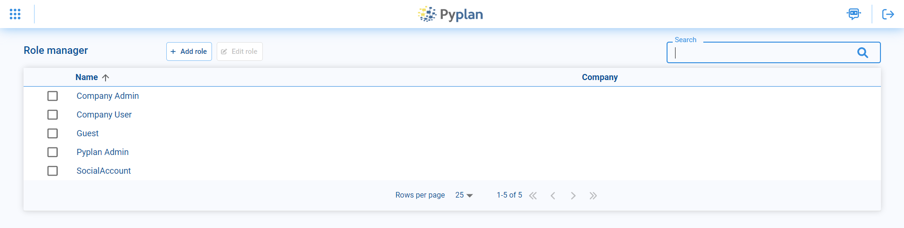
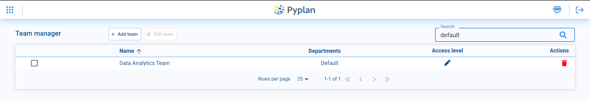
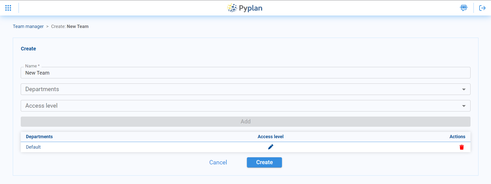
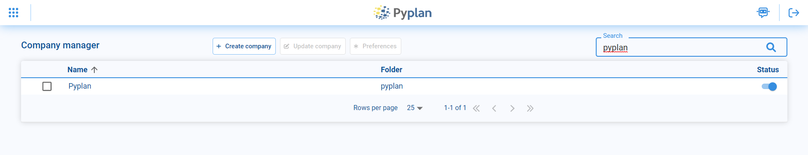

Opciones de seguridad
=====================

Pyplan cuenta con varias opciones de seguridad para administrar usuarios y sus permisos correspondientes.
Cada usuario puede tener acceso a distintas compañias, y tener distintos departamentos y roles.

-------------------------
Administrador de usuarios
-------------------------

Pyplan cuenta con un adiministrador de usuarios para gestionar los usuarios, roles y departamentos correspondientes.
Se encuentra disponible en el menú **Security options** bajo el nombre **Users**.  

.. image:: images/users.png

|

Dentro del administrador se pueden ver todos los usuarios y, en caso de tener los permisos correspondientes, crear o editar 
usuarios de Pyplan.

|

Creación de usuarios
--------------------

Para crear un usuario nuevo se debe acceder a la opción de **Add user** dentro de **User manager**

|

Para ello, se tiene que especificar los siguientes campos: **First Name**, **Last Name**,  **Email**, **Username**, **Password**.

|

Luego se elige, para cada compañia que se quiera asignar al usuario, los roles y departamentos correspondientes.

.. image:: images/add_user_company.png

|

Editar usuarios
---------------
También es posible editar usuarios ya existentes. Para ello se debe seleccionar el usuario que se desea editar
y en el menú superior elegir la opción **edit user**. Además es posible cambiar la contraseña ingresando a 
la opción **change password**.

|

-----
Roles
-----
Un rol es una colección de permisos que se asignan a un usuario dentro de plataforma.
Los roles pueden ser asignados y personalizados de acuerdo a las necesidades de cada organización.

|

Los roles se crean accediendo a la opción **Add role** en el menu superior. Luego se debe seleccionar a que compañia
va a pertenecer el rol, el nombre y uno de los templates que tiene configurados un conjunto de permisos predeterminados,
que luego se pueden modificar y personalizar en la opción de **Permissions by role**.

.. image:: images/roles_create.png

|

----------------
Permisos por rol
----------------

Los permisos asignados a cada rol pueden ser modificados desde la opción **Permissions by role**. 
Al ingresar se puede ver la lista de permisos, que se encuentran agrupados por distintos aspectos de la plataforma, 
como, por ejemplo, **file manager** 
o **interfaces**.

.. image:: images/permissions.png

|

Al desplegar alguno de los grupos, se detallan los permisos y se pueden editar para cada uno de 
los roles de la compañia actual, marcando o desmarcando las casillas de selección correspondientes.

.. image:: images/permissions_detail.png

|

-------------
Departamentos
-------------

Los departamentos determinan permisos sobre los datos, por ejemplo denegar acceso a ciertas carpetas en 
el administrador de archivos o a ciertas interfaces de una aplicación, asi como también las especificaciones
de hardware de las instancias que se utilizarán.
Al abrir el administrador de departamentos se pueden ver los departamentos existentes, y pueden editarse o crearse nuevos.

.. image:: images/departments.png

|

Para crear un nuevo departamento, en el menú superior se debe seleccionar la opción **Add department**. Luego se debe 
elegir el nombre del departamento a crear, a que compañia corresponde y la definición del engine.

.. image:: images/departments_creation.png

|

-----
Teams
-----

Los Teams permiten el trabajo en grupo de ciertos usuarios, compartiendo archivos y aplicaciones dentro de una compañia, solo con 
los usuarios que forman parte de un Team en particular. Cada team cuenta con una carpeta en el administrador de archivos, dentro de la carpeta Teams,
a la que pueden acceder solo los usuarios que forman parte del Team.
Cuando se abre el Team manager pueden verse los teams existentes en la compañia. Se pueden agregar nuevos teams o editar 
los ya existentes.

|

Para crear un Team nuevo, se debe seleccionar la opción **Add team** y a continuación, elegir un nombre para el nuevo team. Luego se
pueden agregar distintos departamentos para acceder permisos al team, cada uno con su nivel de acceso (sólo lectura o lectura y escritura).

|

---------
Compañias
---------

Dentro de Pyplan, cada compañia ofrece un ambiente aislado para que los distintos usuarios de la empresa puedan trabajar en forma
conjunta, pudiendo compartir archivos y aplicaciones. 
Desde el administrador de compañias pueden crear compañias nuevas y editar las existentes.

|

Al crear una compañia nueva se debe elegir el nombre y además el nombre de la carpeta donde se guardaran todos los archivos
correspondientes de la compañia.

.. image:: images/company_creation.png

|

Además al crear una compañia nueva se debe proveer una licencia de Pyplan para que la compañia nueva se encuentre activada.
Esto permite que la compañia este activada por un periodo y para una cierta cantidad de usuarios que vienen determinados por la licencia.

.. image:: images/company_update.png

|