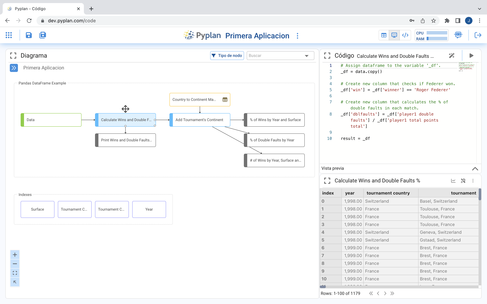
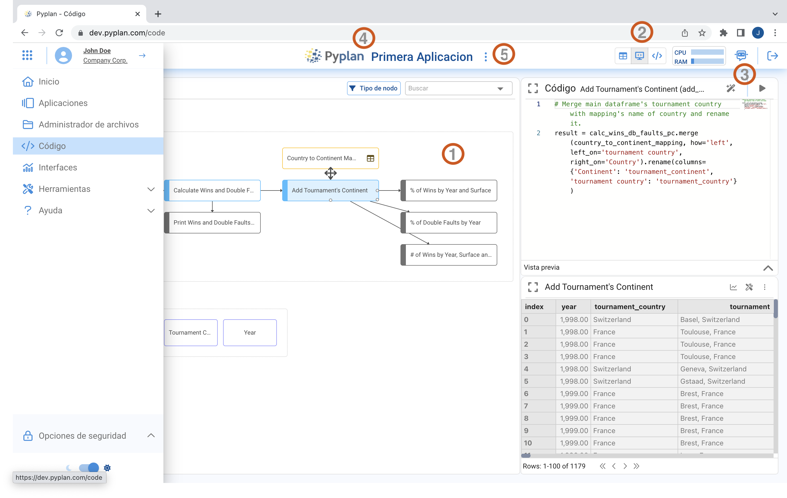
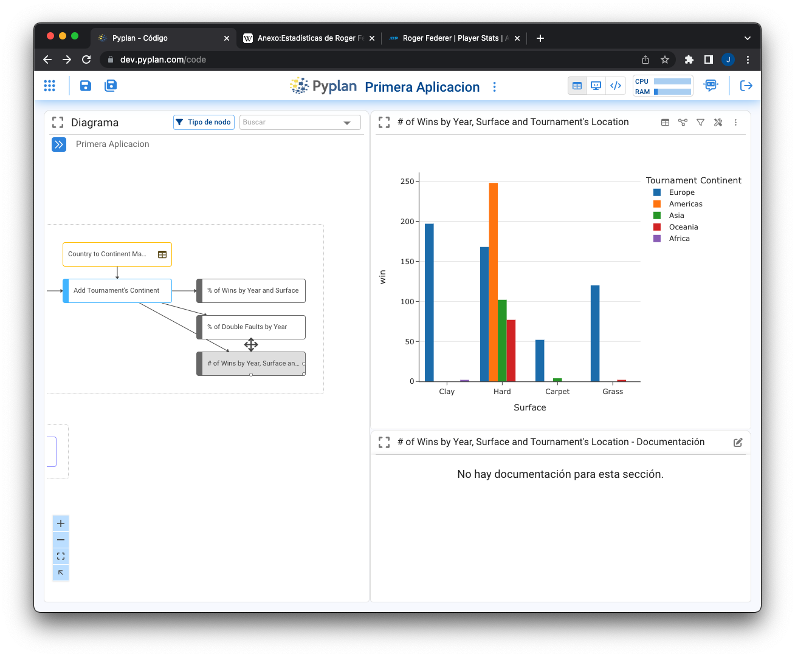
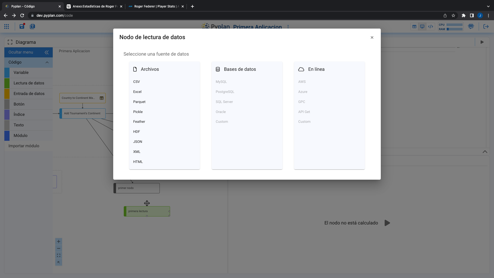

Ventana de Codificación
=======================

=================================
Creación de la primera aplicación
=================================

Pyplan es un ambiente de desarrollo integrado de aplicaciones, pensado para usuarios sin conocimientos de programación.
Es por esto que la forma de construir la lógica de cálculo y procesamiento de las aplicaciones se produce a través de bloques o pasos de cálculo, representados por nodos en un diagrama de influencia.
Al hacer click en **crear una aplicación**, aparece un cuadro de diálogo que permite optar entre crear una aplicación desde cero o a partir de un ejemplo.

.. figure:: images/create_appg.gif

Eligiendo crear una aplicación de análisis de datos y luego seleccionando la **visualización del código** se llega a una ventana como la siguiente:

   
=======================================
Elementos de la ventana de codificación
=======================================

Una vez hecho click en el icono de **código** del menú principal, se accede al diagrama de influencia:

Los elementos que constituyen esta sección de la plataforma son:

1. **Diagrama de influencia**: Representación gráfica del procesamiento de datos hasta su transformación en salida.
2. **Tipos de visualización de nodos**: Resultado | Codigo+Resultado | Codigo+Preview.
3. **Bot de ayuda**: Robot asistente que interpreta lenguaje natural para responder a preguntas sobre el uso de Pyplan.
4. **Atajos de Navegación**: Link a Pyplan Home y al Home de la aplicación, accesibles al hacer click sobre el logo de Pyplan y el título de la aplicación, respectivamente.
5. **Propiedades de una aplicación**: Desplegables al hacer click en los tres puntos a la derecha del título de la app.

  
----------------------
Diagrama de Influencia
----------------------

Es la representación gráfica del proceso de cálculo. 
Cada nodo representa un paso de cálculo en el proceso de transformación de los datos.
Un nodo se selecciona haciendo click sobre el mismo.
Al hacer doble-click sobre un nodo, este es evaluado y su resultado se muestra a pantalla completa de acuerdo a su configuración de visualización predeterminada.
Los vínculos (flechas) entre nodos son generados automáticamente el invocar un nodo dentro de la definición de otro.

.. warning:: (aquí debiéramos incluir un link a una de las lecciones que te muestren paso a paso esta sección)

--------------------------
Características de un Nodo
--------------------------
Un nodo es la unidad mínima de construcción del proceso de cálculo. 
Para agregar un nodo se arrastra el mismo sobre el diagrama.

Cada nodo cuenta con las siguientes propiedades:

Título del nodo
---------------
Es el texto que se visualiza dentro del nodo en el diagrama

Id del nodo
-----------
Es el identificador del nodo, es la forma en la que un nodo es invocado en la definición de otro nodo. El Id del nodo se genera automáticamente a partir del título, pero puede ser cambiado por el usuario.

Unidades
--------
En caso de que un nodo contenga una medida única es posible indicar su unidad, que será mostrada entre paréntesis al lado del título al momento de mostrar los resultados del nodo. Vale destacar que las unidades solo se incluyen para ser visualizadas, no formando parte del calculo de resultados.

.. image:: images/propiedades_grales_nodo.png
---------------------------------------------

Definición
----------
Es la operación de transformación ejecutada al evaluar un nodo. Su código esta escrito en lenguaje Python. Termina con la definición de su resultado **"result="**

Vista Previa
------------
Es la descripción técnica de la salida del proceso de cálculo.

Resultado
---------
Es el resultado que surge de ejecutar el código de la definición. Este resultado puede visualizarse de forma gráfica o de tabla.

.. images:: images/nodo_def_pv_res.png

Documentación
-------------
Es el texto que describe conceptualmente cada paso de cálculo y se despliega en la parte inferior de la vista de resultados.

Entradas
--------

Listado de nodos utilizados en la definición de un nodo.

Salidas
-------

Listado de nodos que utilizan el resultado del nodo seleccionado

.. image:: images/propiedades_sa-_nodo.png

A todas estas propiedades de nodo se accede haciendo click y seleccionándolo. Haciendo doble-click, evaluándolo o haciendo click con el botón derecho del mouse una vez seleccionado el nodo.

-------------
Tipos de Nodo
-------------

Existen diferentes tipos de nodos para diferentes propósitos. Sus funcionalidades han sido diseñadas para facilitar la definición de los parámetros necesarios para su ejecución.

.. image:: images/types_node.png

Variable
--------
Los nodos de tipo variable son los más utilizados, dado que tienen la función de contener un proceso de cálculo genérico.
Son de color azul inicialmente. Este color cambia a gris en caso que un nodo no tenga salidas y se lo considera un reporte.
Por otra parte, cambia a un color rojo en caso que las salidas del nodo se encuentren fuera del modulo al que pertenece.

Lectura de datos
----------------

Nodo que al arrastrarlo despliega un asistente para conectarse a distintas fuentes de datos.

.. image:: images/asistente_csv.png

Entrada de datos
----------------
Nodo que permite crear un proceso de entrada de datos manuales. 

.. image:: images/tipo_de_ent_datos.png

Una vez elegido el tipo de entrada de datos se despliega un asistente para su configuración. En este caso se muestra el asistente para crear una 
Tabla de entrada de datos.

.. image:: images/entrada_tabla.png

Botón
-----
El boton es un nodo especial que permite ejecutar acciones sobre los nodos.

Índice
------
El nodo índice es la forma en que Pyplan almacena las dimensiones que son utilizadas a través de todo el proceso de cálculo.
Su definición conduce a la determinación de una lista de elementos que constituyen la dimensión.
Tienen un funcionamiento particular cuando se los incluye en interfaces.

Texto
-----
El cuadro de texto es un elemento de construcción del diagrama con fines solamente de organización del diagrama de influencia.

Módulo
------
Es un tipo de nodo especial que contiene nodos en su interior. Se ingresa a un módulo haciendo doble-click sobre él. Los módulos pueden estar anidados indefinidamente.

----------------------------------------
Operaciones en el Diagrama de Influencia
----------------------------------------

Navegación
----------

El diagrama de influencia es una representación jerárquica de la lógica de cálculo. 
El desplazamiento dentro del diagrama puede ser manual, haciendo doble-click en el módulo que se quiera entrar o haciendo click en el camino generado a partir de la navegación para subir a las jerarquías superiores.

Inspección de propiedades de nodos
----------------------------------

Al seleccionar un nodo, haciendo click con el boton derecho del mouse, se despliega una ventana de propiedades del nodo.

