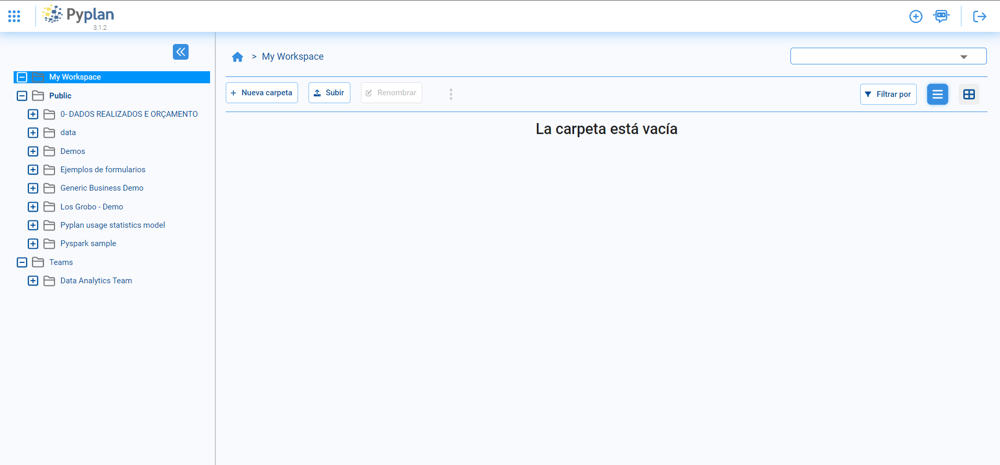

**Administrador de archivos**
=========================
Los usuarios tienen su propio espacio de trabajo y también pueden acceder a un espacio de trabajo público. El administrador de archivos brinda asistencia para trabajar con archivos relacionados con sus aplicaciones.
Al hacer clic en el nombre de Administrador de archivo que se encuentra en el menú de la izquierda de la pantalla pricipal, usted accederá a otra pantalla que contiene una jerarquía de carpetas. Las mismas se indagan a traves de los signos + (abre carpetas) o - (cierra carpetas).

.. figure:: images/imagen1.png
   :width: 400%

En la misma pantalla, hay funciones para filtrar por lo que se requiera, opciones de vistas y una barra de busqueda. Ademas, en el margen superiro derecho hay distintos iconos ya comentados en otros apartados, pero se agrega la función de Guardar y Guardar como. 

==========================
**Organización de Pyplan**
==========================

Modelo
------
Pyplan organiza el código de Python en nodos que se representan como un flujo de trabajo (diagrama de influencia). En esta sección, se explican todas las herramientas y características creadas para ayudarlo a construir la lógica de cálculo y manipulación de datos.

Visualización
-------------
Los pasos de los cálculo están contenidos en nodos que terminan con un resultado. Dichos nodos se pueden evaluar y su resultado se puede observar en una tabla, un gráfico o en un mapa. Todas las alternativas de visualización nativa de Pyplan y las configuraciones de parámetros se describen en esta sección. Es importante resaltar que también es posible usar muchas otras bibliotecas de visualización disponibles en Python, como Bokeh o Plotly para renderizar resultados.

Diseñador de interfaz
---------------------
La visualización y los controles de usuario se agrupan en interfaces que permiten al usuario interactuar con su aplicación y explorar los resultados. En este apartado, explicaremos cómo crear, configurar y compartir estas aplicaciones. Lo más importante: ¡no se requiere codificación!

Configuración y Gestión de Usuarios
-----------------------------------
La versión empresarial de Pyplan se instala en un servidor o se proporciona como un servicio a través de Amazon Elastic Cloud. En esta sección, exploraremos la arquitectura de la aplicación y cómo administrar usuarios en términos de seguridad y recursos.

Tutoriales, ejemplos y demostraciones
-------------------------------------
En la carpeta Pública a la que puede acceder a través del Administrador de archivos, encontrará muchos modelos de Pyplan agrupados como Tutoriales, Ejemplos y Demos. Los tutoriales son ejemplos básicos que ilustran cómo Pyplan maneja e interactúa de forma nativa con los objetos de Python. 
Los ejemplos pretenden demostrar lo que se puede hacer con Pyplan. Puede revisar su código para comprender cómo adaptar o reutilizar cualquier 
pieza de código en su propio proyecto. En la carpeta Demos , encontrará aplicaciones completas relacionadas con ciertos temas y/o industrias.

Lo que no encontrará en la Guía del usuario
----------------------------------------------
Pyplan puede considerarse un entorno de desarrollo integrado de Python para aplicaciones de análisis de datos. Esta Guía del usuario no pretende explicar cómo programar en Python ni en ninguna de las otras bibliotecas utilizadas, como Pandas, Numpy o Xarray (solo por nombrar algunas de ella). Hay muchos tutoriales y cursos introductorios para que aprendas. 
La propia documentación de las bibliotecas siempre es una buena fuente de información,
 y para cualquier tarea desafiante, también puede contar con la ayuda de la comunidad reunida en sitios como StackOverflow.

Antiguos usuarios de Cubeplan
-----------------------------
Pyplan es la evolución del software de Cubeplan. Las mejoras fueron tan radicales que requirieron un cambio en el nombre del producto. Sin embargo, para facilitar a los antiguos usuarios de Cubeplan la migración a Pyplan, hemos creado una biblioteca que reproduce, de la forma más similar posible, las funciones y la sintaxis de Cubeplan. Los modelos de Cubeplan no se pueden ejecutar en Pyplan. 
Una buena manera de aprender a usar Python es migrar un modelo de Cubeplan existente.

