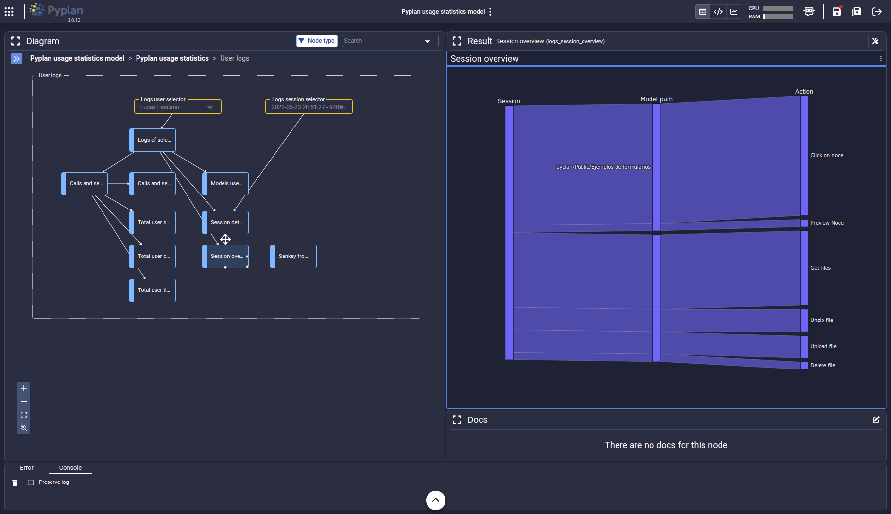

.. Pyplan documentation master file, created by
   sphinx-quickstart on Tue May 24 11:53:29 2022.
   You can adapt this file completely to your liking, but it should at least
   contain the root `toctree` directive.

.. toctree::
   :hidden:
   :caption: Overview
   :titlesonly:

   overview/index

.. toctree::
   :hidden:
   :caption: User Guide
   
   user_guide/index
 

.. figure:: images/logo.png
   :width: 300

Welcome to the Pyplan documentation
===================================

Pyplan is a graphical Integrated Development Environment for creating and sharing Data Analytics Apps

=========
Pyplan UI
=========

==========================
Lorem ipsum dolor sit amet
==========================

Suspendisse quis eros odio. Nam eget tellus vel magna hendrerit pretium id vitae tellus. Nam nec dictum massa. Proin efficitur metus non ex tincidunt efficitur. Suspendisse potenti. Donec mollis molestie suscipit. Maecenas purus lorem, consectetur a tincidunt sed, pharetra quis tellus.
   
.. tip:: Sed ullamcorper erat vitae ipsum ultrices porttitor eu sit amet nibh

