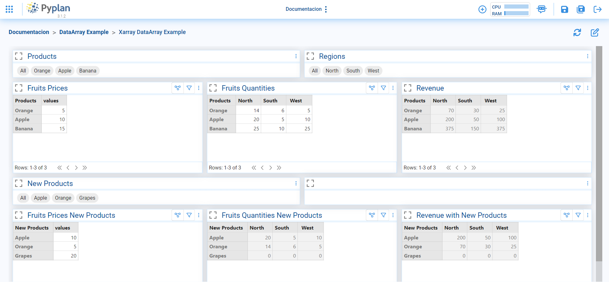
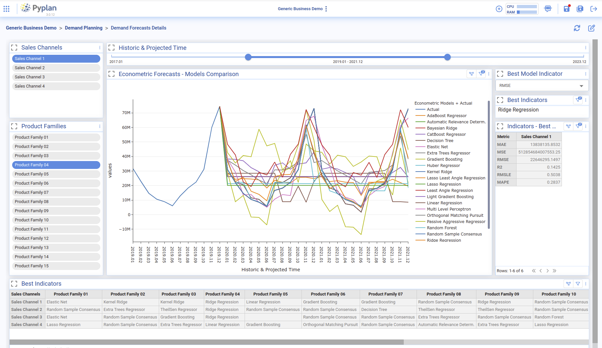

.. Pyplan documentation master file, created by
   sphinx-quickstart on Tue May 24 11:53:29 2022.
   You can adapt this file completely to your liking, but it should at least
   contain the root `toctree` directive.

.. toctree::
   :hidden:
   :caption: GUIA DE USUARIO
   
   
   user_guide/index
   file_manager/index

.. figure:: images/logo.png
   :width: 300

**BIENVENIDO A PYPLAN** 
=======================

Pyplan es un entorno de desarrollo gráfico integrado, asistido y diseñado para crear y compartir fácilmente aplicaciones de análisis de datos basadas en el lenguaje de programación Python.

Pyplan permite integrar en un solo lugar todas las tareas analíticas que dan soporte a la toma de decisiones corporativas. Aliméntese automáticamente de fuentes de datos dispares, continúe monitoreando lo que sucede, deduzca tendencias utilizando modelos predictivos autocalibrados y simule impactos en toda su empresa para descubrir el mejor curso de acción.

=====================
Codificando en Pyplan
=====================
Una vez que haya leido la Guia de usuario con Introducción y el administrador de archivos en el margen superior izquierdo de la página principal, y haya crado su primer aplicación, al ingresar en la misma (haciendo clic en el cubo) podra editar y/o refescar la interfaz en el margen superior derecho. 

==========
Interfaces
==========

