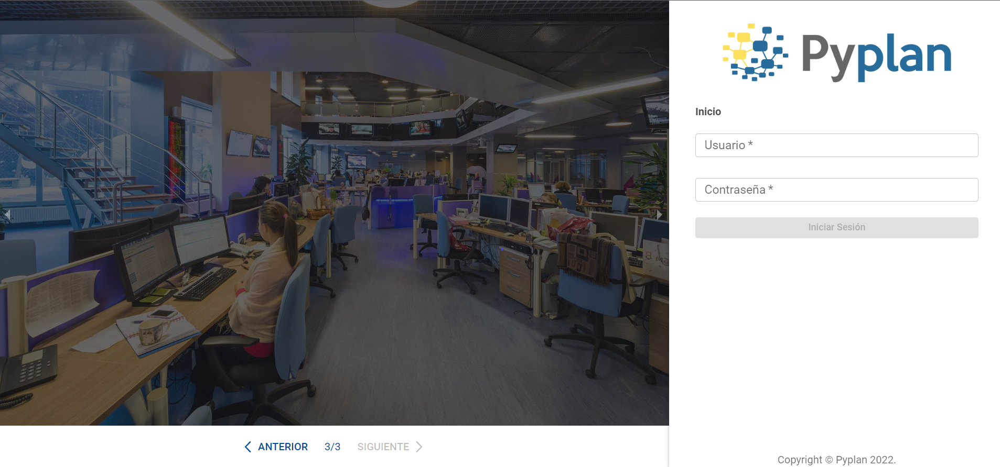
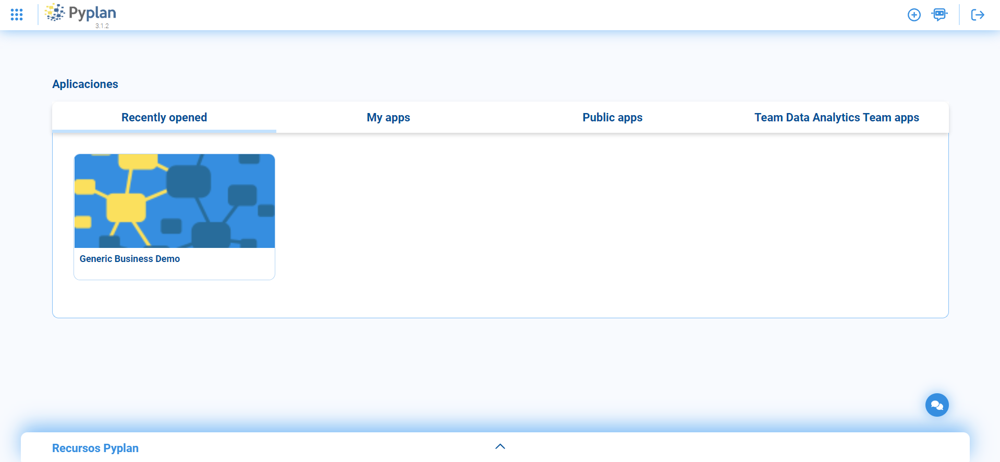
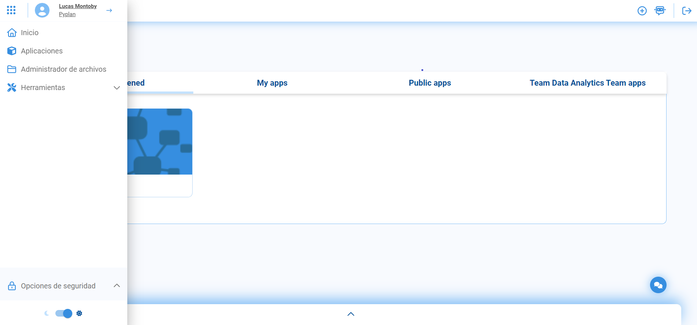
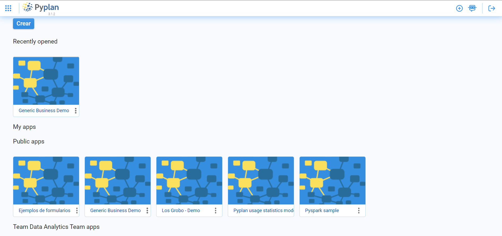
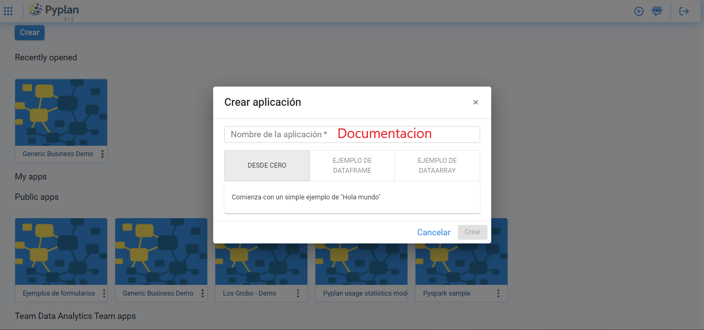
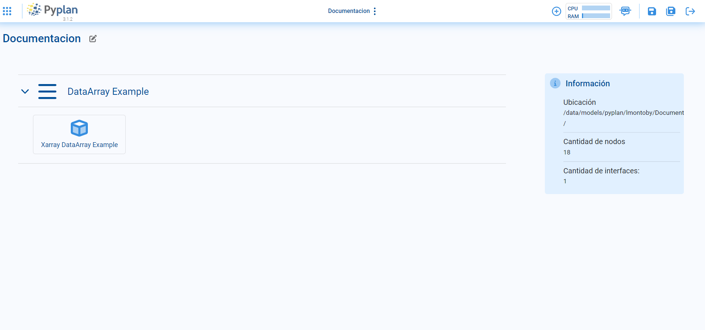

INTRODUCCIÓN
==============

====================================
Pyplan ejecutándose en el escritorio
====================================

Las siguientes secciones cubren las funcionalidades y características básicas de Pyplan. Pyplan está en evolución permanente, por lo que probablemente encontrará pequeñas diferencias entre este documento y la última versión de Pyplan que se ejecuta en línea.

Para ingresar a Pyplan, haga clic en el siguiente en la interfase. 

En el caso de que haya instalado Pyplan en su computadora, tan pronto como lo inicie, accederá a la página de inicio de la aplicación, donde se mostrará la siguiente imagen:

Una vez logueado con su susario y contraseña, ingresara a la siguiente sección:

------------------------
Inicio de la aplicación 
------------------------
Después de iniciar sesión, el usuario llega a la página de inicio de la aplicación, donde encontrara su Cuenta, y debajo el menu que contiene varias solapas como Inicio, Aplicaciones, Administrador de archivos, y Herramientas.
En la pantalla principal, viisualizará ademas, todas las aplicaciones vigentes. Por último, en el margen inferior encontrara los Recursos Pyplan que al abrirlo, contendra videos de Pyplan en acción y Documentación con los pasos básicos para el manejo del Software.  
También en la pantala principal, en el margen superior derecho podrá visualizar el signo + con un circulo que al darle clic puede crear aplicaciones directamente. A su lado, se encuentra Pyplan Bot, que es una herramienta que le permite realizar consultas para el despeje de dudas
Por último, se ensuentra la pestaña para poder cerrar su sesión.

------------------
Crear aplicaciones
------------------
Al ingresar en el menu de la pantalla principal y hacer clic en el nombre Aplicaciones, usted será redirigido al administrador de aplicaciones donde podrá crear las mismas, pero también visualizará las aplicaciones ya creadas por usted y un conjunto de aplicaciones públicas que 
contienen información con ejemplos de formularios, Demos, y otros ejemplos que le serán de utilidad como fuente de consulta cuando así lo requiera.

Para crear nuevas aplicaciones, al hacer clic en el botón Crear, usted puede otogar un nombre a la misma, pudiendo seleccionar si la misma será DESDE CERO, EJEMPLO DATAFRAME O EJEMPLO DATAARRAY. Una vez seleccionada la opción elegida, presionara crear y podrá observar en otra 
pantalla su resultado.

